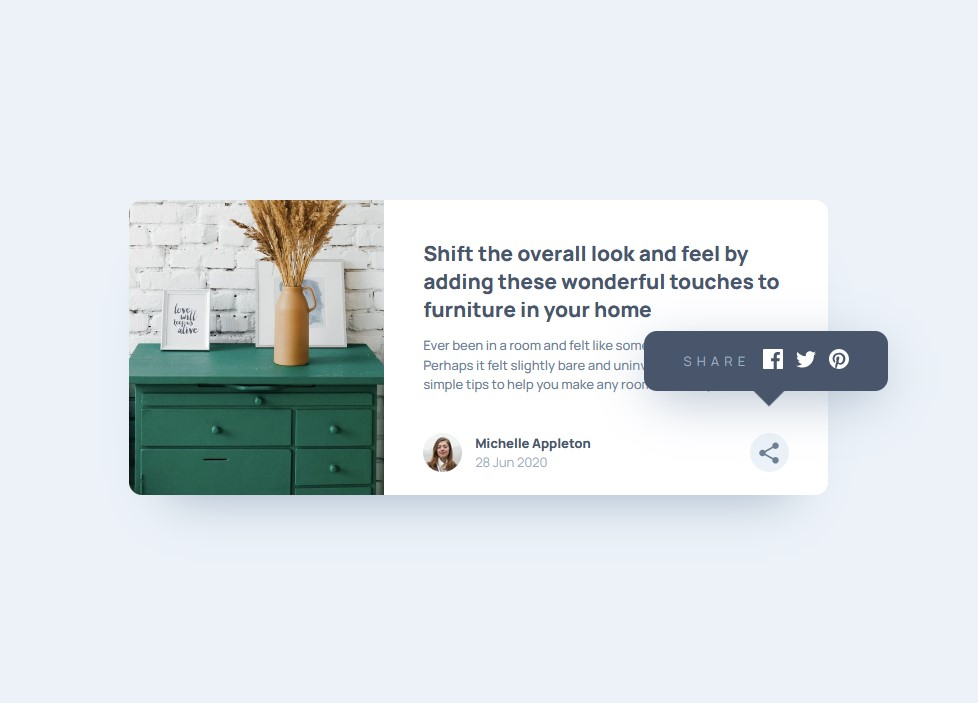

# Frontend Mentor - Article preview component solution

This is a solution to the [Article preview component challenge on Frontend Mentor](https://www.frontendmentor.io/challenges/article-preview-component-dYBN_pYFT). Frontend Mentor challenges help you improve your coding skills by building realistic projects. 

## Table of contents

- [Overview](#overview)
  - [The challenge](#the-challenge)
  - [Screenshot](#screenshot)
  - [Links](#links)
- [My process](#my-process)
  - [Built with](#built-with)
  - [What I learned](#what-i-learned)
  - [Useful resources](#useful-resources)
- [Author](#author)

## Overview

### The challenge

Users should be able to:

- View the optimal layout for the component depending on their device's screen size
- See the social media share links when they click the share icon

### Screenshot

### Links

- Solution URL: [https://github.com/ivan-develops/Article-preview-component](https://github.com/ivan-develops/Article-preview-component)
- Live Site URL: [https://ivan-develops.github.io/Article-preview-component/](https://ivan-develops.github.io/Article-preview-component/)

## My process

### Built with

- Semantic HTML5 markup
- CSS custom properties
- Mobile-first workflow
- Flexbox
- CSS Grid
- Basic functions Javascript

### What I learned

- Selecting nodes from the DOM. Designing basic functions and methods in JavaScript.

- Better handling of the `Clamp()` function in CSS.

- Initially, the button event modified the value of a CSS property:

`modal.style.visibility = "visible";`

This method didn't work properly for all the required breakpoints. So, another solution was found, including a new "active" class, which allowed the modal's visibility to be toggled:

`modal.classList.toggle('active');`

### Useful resources

- Pixel Perfect Pro - You can trace the design image from the browser

## Author

- Website - [https://github.com/ivan-develops](https://github.com/ivan-develops)
- LinkedIn - [@ivanvargaso](https://www.linkedin.com/in/ivanvargaso/)
- Frontend Mentor - [@ivan-develops](https://www.frontendmentor.io/profile/ivan-develops)